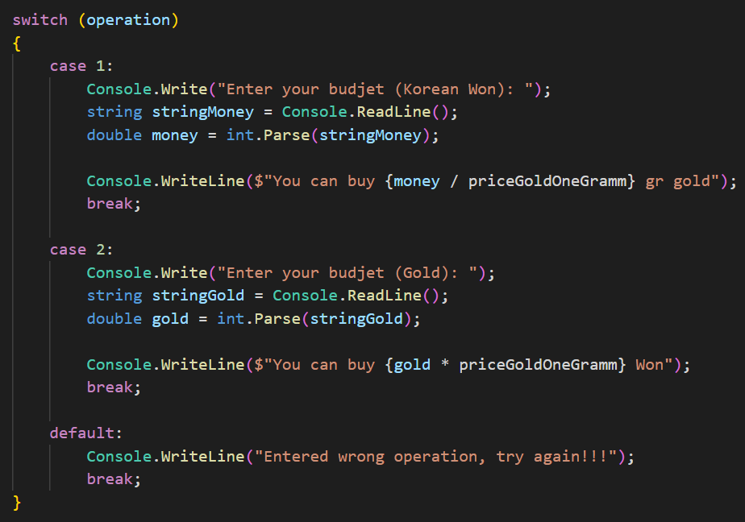
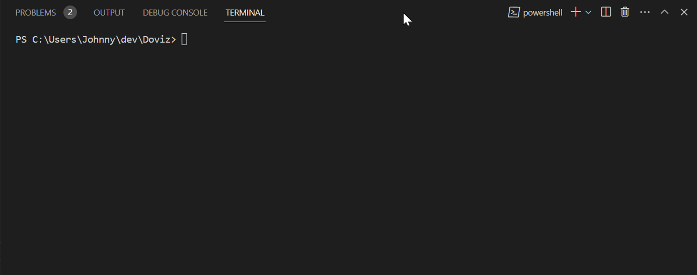

# Doviz

Your ultimate conversion tool

    You can choose option that you need:
    1. If you want to buy gold, this app can convert your money to gold.
    2. If you want to convert your gold to money, this app help you.

I have used basic code and arithmetic operations:

* Console input/output

    

* Arithmetic operations and `string` interpolation

    

* `switch` statement

    

### Result:

If you want to run my code in your local computer, you can clone my code.

Click here for instruction **[video](https://www.loom.com/share/9cebefe04b8b40f0bb6c48f87f58ad59?sid=d2569b47-887d-4227-bc0b-4884d6b52b16)**

## Release Notes

### V1.0

We are excited to announce the release of version 1.0 of our Doviz App! This release introduces basic convert operations.

Features Added:

* You can choose option that you need:
* If you want to buy gold, this app can convert your money to gold.

### Path to Version 1.0

Click green word if you want to go **[Version 1.0](https://github.com/JohnnySenior/Doviz/tree/releases/v2.0)**

### V2.0

We are excited to announce the release of version 2.0 of our Doviz App! This release introduces basic convert operations.

Features Added:

* Bug fixes and other minor improvements.
* Add switch statement.
    * If you want to buy gold, this app can convert your money to gold.
    * If you want to convert your gold to money, this app help you.
    
### Note: You are in **_Version 2.0_** now.